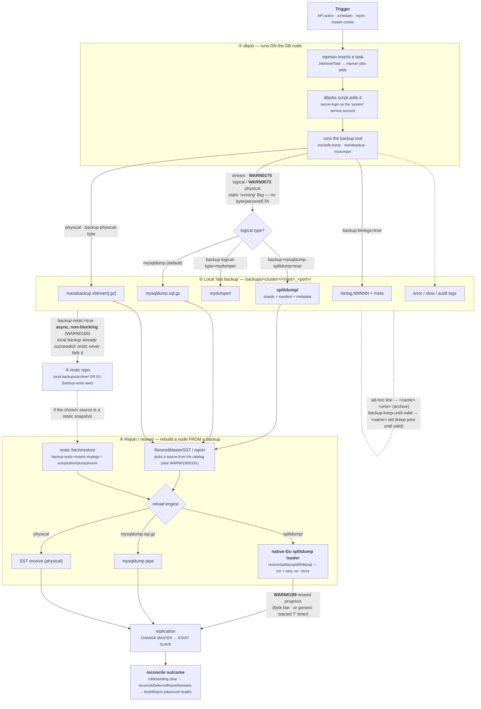

# Backup paths — full lifecycle (trigger → dbjob → dump → paths → archive → rejoin)

*(2026-07-23. Maps every backup path with the config that activates it and the state shown while it runs. Source of truth: `cluster/srv_job_backup.go`, `cluster/srv_job.go`, `cluster/backup_helpers.go`, `utils/splitdump/*`, `utils/backupmgr/restic.go`, `config/error.go`.)*

## The graph

## ① dbjob — the task actually runs on the DB node
repman does not dump from itself; it schedules a **job** the DB node executes:
- `JobInsertTask` / `JobInsertTaskWithPayload` (`cluster/srv_job.go`) writes a task (with optional `payload`) into the repman jobs table in the DB.
- the on-node `dbjobs` script authenticates back via **secret-login** (the `system` service account, `secretLoginHandler`), fetches its task, runs the backup tool, and streams output to the local path (§2).
- status flows back through `JobsUpdateEntries` / `JobsCheckPending` / `JobsCheckErrors`; job-state ints (`srv_job.go`): `0 Available · 1 Running · 2 Halted · 3 Finished · 4 Success · 5 ErrorExec · 6 ErrorAfter`. These drive the WARN states in §5.

## ② Local "last backup" — `backups/<cluster>/<host>_<port>/`
`GetMyBackupDirectory()` → `<WorkingDir>/<ConstStreamingSubDir="backups">/<cluster>/<host>_<port>/`. Current backup is **overwritten in place** (the "last backup" slot). Artifacts by type:

| Path (`backup-logical-type` / physical) | File(s) produced |
|---|---|
| mysqldump (default) | `mysqldump.sql.gz` (single gzip) |
| mysqldump + `backup-mysqldump-splitdump=true` | `splitdump/` — sharded `<schema>.<table>.<NNNNN>` + `manifest` + `metadata` |
| `backup-logical-type=mydumper` | `mydumper/` |
| physical (`backup-physical-type`) | `xtrabackup|mariabackup.xbtream[.gz]` + `.meta.json` |
| `backup-binlogs=true` | `binlog.NNNNN` + `binary-logs.meta.json` |
| `backup-split-mysql-user=true` | separate `mysql.users.sql.gz` |

**"last backup" vs archive:** timestamped filenames (`<name>.<unix>`) come from the **ad-hoc backup line** (retention set, or backup requested on a non-master/non-backup server) — *not* from retention config. `backup-keep-until-valid` only renames the previous slot to `<name>.old` until the new one validates.

## ② dump pipeline — the "no running progress" gap
`JobBackupMysqldump` runs `mariadb-dump` and tees the stream: `io.TeeReader(stdout, teeWriter)` → gzip file (monolithic) or the splitdump pipe. The read loop taps the stream **only to scrape the GTID / `CHANGE MASTER` position** — there is **no byte counter, no percent, no stall watchdog**. splitdump prints `Processing table data/schema <name>` but only at **debug** level. So while a dump runs, the only cluster-visible signal is the static `WARN0175`/`WARN0073`. *(This is the backup-progress gap — a future counterpart to the reseed's `WARN0189`.)*

## ③ restic — the second, separate, async step
Restic runs **only after** the local backup succeeds (`if resticEnabled && err==nil { BackupRestic(...) }`), enqueued async via the `ResticManager` with a callback. It **never fails or rolls back the local backup** — a missing/uninitialized repo just logs an error and clears the restic flag (auto-init only if `backup-restic-auto-init=true`, and never for SFTP). S3 archival is done **exclusively via restic** (`backup-restic-aws`); the separate `backup-streaming*` config is legacy/dead — never read in the backup path.

## ④ Rejoin / reseed — consuming a backup to rebuild a node
`ReseedMasterSST` / `RejoinDirectDump` / `ProcessReseedLogical` pick a source from the catalog (none → `WARN0190` logical / `WARN0191` physical). If the source is a restic snapshot, it is fetched/restored first (`backup-restic-reseed-strategy`). The reload engine is the **native-Go splitdump loader** (`restoreSplitdumpWithMysql`, transactional + retry, no `mysql --force`) for `splitdump/`, a mysqldump pipe for `mysqldump.sql.gz`, or SST receive for physical. Progress shows as `WARN0189` (byte bar when instrumented, else a generic "started T" timer). Completion is reconciled from **observed health** at `IsReseeding` clear (`reconcileDeferredRejoinReseeds` → `finishRejoin`) — see `UNIFIED_REJOIN_DESIGN.md`.

## ⑤ States while running (config/error.go)

| Code | Message | When |
|---|---|---|
| `WARN0174` | Waiting for global backup slot (%d/%d) | backup semaphore full (`backup-concurrent-slots`) |
| `WARN0073` | Running physical backup %s on %s | physical dump running (static flag until done) |
| `WARN0175` | Running logical backup %s on %s | logical dump running (static flag until done) |
| `WARN0110` | Pending %s backup … waiting | another backup in progress on the server |
| `WARN0166` | restic reseed/backup queued | restic second step enqueued |
| `WARN0189` | Restore in progress on %s … | reseed/restore running (byte or generic timer) |
| `WARN0190` / `WARN0191` | No logical/physical backup available for rejoin | rejoin catalog empty |
| `WARN0074` / `WARN0075` | Reseeding physical/logical backup | reseed armed → triggers ProcessReseed* |
| `WARN0113/0115/0116` | backup/reseed failures | failure paths |
| `WARN0139/0140` · `WARN0141/0142/0143` | disk threshold · not enough free space | pre-backup space checks |

> The dump-running states (`WARN0073`/`WARN0175`) are **binary "running" flags**, PreserveState-held until the job ends — no progress detail. The backup slot is released on their *resolution* (`ReleaseBackupSlot`, non-blocking to avoid a monitor deadlock).

## ⑥ Config that activates each path (selected)

| Flag | Default | Activates / controls |
|---|---|---|
| `backup-logical-type` | `mysqldump` | logical path: `mysqldump | mydumper | river` |
| `backup-mysqldump-splitdump` | `false` | mysqldump → sharded `splitdump/` (native-Go loader on reseed) |
| `backup-splitdump-file-size` | `1G` | shard roll size |
| `backup-physical-type` | `xtrabackup` | `xtrabackup | mariabackup` (auto-switch on MariaDB >10.1) |
| `backup-binlogs` / `-keep` | `false` / `10` | binlog archival |
| `backup-restic` | `false` | enable restic second stage |
| `backup-restic-aws` | `false` | S3 backend vs local `backups/archive/` |
| `backup-restic-reseed-strategy` | `auto` | reseed from restic: `auto|restore|dump|mount` |
| `backup-restic-auto-init` | `false` | auto `restic init` (not SFTP) |
| `backup-keep-until-valid` | `false` | keep previous slot as `.old` until new validates |
| `backup-concurrent-slots` | `1` | global backup semaphore (→ WARN0174) |
| `backup-streaming*` | — | **legacy/unused — not wired** (S3 = restic only) |
